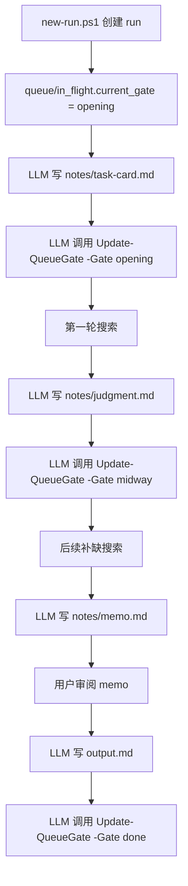
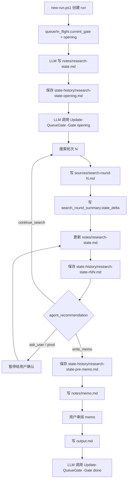
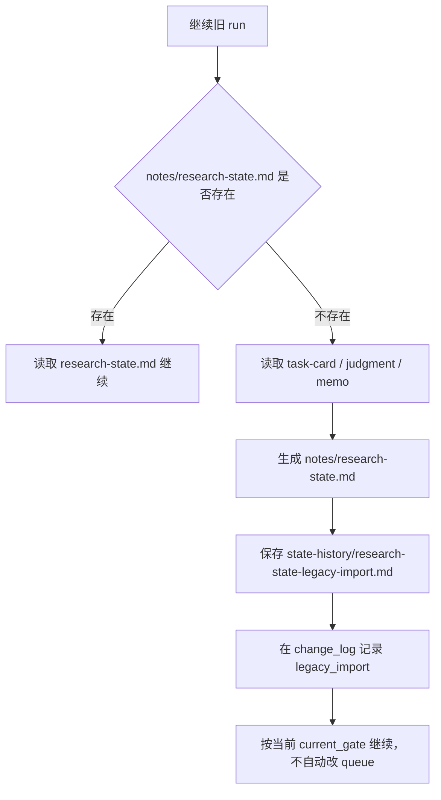

# 修改计划：用 research-state 替代 task-card / judgment

状态：已实施为 SOP v0.8 文档层迁移依据
对应任务：`sop/tasks/research-state-slot-lifecycle.md`
创建时间：2026-06-01

## 结论

`task-card.md` 和 `judgment.md` 本质上都是旧流程里的阶段性视图。新流程不应让它们与 `research-state.md` 并存，也不应该为了兼容旧模板而新增一批字段。

建议：

- 新 run 不再生成 `notes/task-card.md`。
- 新 run 不再生成 `notes/judgment.md`。
- `task-card` / `judgment` 只做覆盖核对：确认旧信息已经由现有 slot、search round 或 memo 覆盖。
- 不保留旧 `工具分配` 字段。默认检索工具规则由 `AGENTS.md` 注入，slot 只记录来源面和搜索意图。
- `memo.md` 保留，作为 output 前的最终 enoughness / action boundary review。
- 历史 run 的旧文件不删除；恢复旧 run 时做 legacy import。

## 当前旧流程梳理



当前脚本事实：

- `new-run.ps1` 创建 `notes/`、`sources/`、`idea.md`、`log.md`，并把 `current_gate` 初始化为 `opening`。
- `Update-QueueGate` 只把 `current_gate` 改成传入 gate，并向 `log.md` 追加 `gate_updated`。
- 脚本不检查 `task-card.md`、`judgment.md`、`memo.md` 是否存在。
- 所以旧流程对 `task-card` / `judgment` 的依赖主要在 SOP，而不是脚本强校验。

## 旧字段覆盖核对

### `template-task-card.md`

| 旧字段 | 现有覆盖位置 / 处理 |
|---|---|
| `主题` | `origin_context.initial_topic` |
| `交付对象` | `use_intent.audience` / `output_action_contract.audience` |
| `这次真正要支持的决定 / 动作` | `objective.decision_or_action` |
| `这次真正要回答的问题` | `objective.research_question` |
| `当前待比较路径 / 候选动作` | `inquiry_shape.candidate_paths` |
| `输出模式` | `output_action_contract.product_shape` |
| `明确不回答什么` | `scope_boundary.out_of_scope` |
| `优先开的检索面` | `search_plan.source_surfaces` |
| `工具分配` | 不迁入 slot。默认工具规则已在 `AGENTS.md` 中规定为加载并使用 `agent-reach`；如果写进 slot，反而会形成低优先级、非自动注入的重复规则 |
| `本轮动作上限` | `scope_boundary.action_boundary` |
| `本轮收尾门槛` | `enoughness.stop_criteria` |
| `用户解读 / 感想` | `origin_context.user_feedback` / `change_log` |

### `template-judgment.md`

| 旧字段 | 现有覆盖位置 / 处理 |
|---|---|
| `当前研究问题` | `objective.research_question` |
| `第一轮地图` | `inquiry_shape.map` 或 `sources/search-round-N.md.key_findings` |
| `当前判断` | 阶段性写入 `search-round-N.md.enoughness_current`，最终写入 `memo.md` |
| `判断成立依赖的前提` | 若影响范围则写入 `scope_boundary`，若影响证据则写入 `evidence_contract`，最终在 `memo.md` 展开 |
| `最短证据链` | `sources/search-round-N.md.key_findings` / `memo.md` |
| `竞争判断` | `inquiry_shape` 的候选路径 / 替代解释，或 tracked facet 的 `alternatives` |
| `待证点列表` | `search_plan.gaps` |
| `第二轮只补什么` | `search_plan.next_round_focus` |
| `用户解读 / 感想` | `origin_context.user_feedback` / `change_log` |

核对结论：旧模板没有需要新增到 slot 模板里的独立字段。`工具分配` 也不迁入 slot，因为它表达的是运行规则，不是研究问题状态；默认检索工具规则应继续放在 `AGENTS.md`。

## 新流程



## Gate 更新逻辑

### Opening

触发条件：

- `notes/research-state.md` 已存在。
- `notes/state-history/research-state-opening.md` 已存在。
- `research-state.md` 中的 `objective`、`scope_boundary`、`search_plan.first_round` 足够进入第一轮搜索。

动作：

```powershell
Update-QueueGate -RunId <id> -Gate opening
```

### Search Round

这不是 queue gate。每轮搜索后只更新 `research-state.md` 并保存 `state-history/research-state-rNN.md`。

触发条件：

- `sources/search-round-N.md` 有 `state_delta`。
- `research-state.md` 已更新当前 formulation、关键判断依据、待证点和下一轮补缺方向。
- `agent_recommendation` 给出 `continue_search / pivot / ask_user / write_memo / stop`。

如果 `agent_recommendation = write_memo`，进入 memo review；不调用 `Update-QueueGate -Gate midway`。

### Memo Review

这不是 queue gate，但必须阻塞 output：

- `notes/state-history/research-state-pre-memo.md` 已保存。
- `notes/memo.md` 已写明 enoughness 和 action boundary。
- 用户确认 memo 后，才写 `output.md`。

### Done

触发条件：

- `output.md` 已完成。

动作：

```powershell
Update-QueueGate -RunId <id> -Gate done
```

## 脚本是否要改

短期：不立即改脚本。

理由：

- 当前 `Update-QueueGate` 不校验标志产物，SOP 替换标志产物即可先跑通。
- 直接改 queue schema 会影响旧 run 和已有 in-flight 项，风险高于当前收益。

后续可能要改：

- `new-run.ps1` 自动创建 `notes/state-history/`。
- `Update-QueueGate` 根据 gate 校验新标志产物。
- 新增 `Test-RunStateConsistency`，检查 `research-state.md`、latest `search-round-N.md`、`state-history/` 是否一致。
- 重新设计 `current_gate` 语义，把它从 `opening / midway / done` 改成更清楚的 phase 状态，例如 `opening_pending / searching / memo_review / drafting / done`。

推荐顺序：

1. 先改 SOP 和模板。
2. 用 shadow pilot 手动跑 1-2 个新 run。新 run 不再调用 `Update-QueueGate -Gate midway`。
3. 如果新 artifact 稳定，再改脚本做目录创建和 gate 校验。
4. 最后再考虑 queue schema migration。

## 历史 run 兼容

旧 run 不批量迁移。恢复旧 run 时按需执行 legacy import：



legacy import 原则：

- 只导入旧文件里明确写出的内容。
- 不因为旧文件存在就自动把 slot 标成 `confirmed`。
- 导入值的 `basis` 使用 `legacy_doc`。
- 如果旧 `current_gate` 与文件内容明显冲突，暂停并让用户确认，不自动改 queue。
