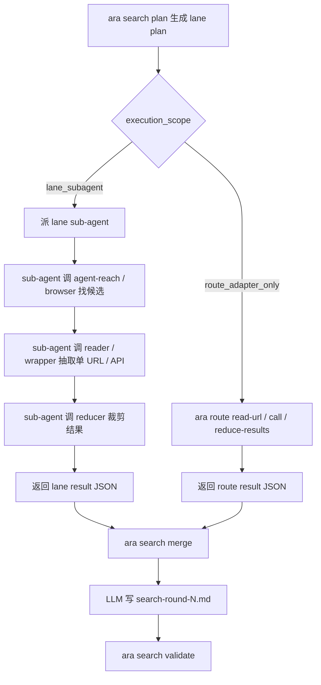

# 工具上下文隔离改造计划

状态：草案
创建时间：2026-06-12
最近更新：2026-06-12
依据：`runs/2026-06-02-sub-agent-context-management/sources/search-round-4.md`
上级总览：`sop/tasks/workflow-cli-tooling-overhaul-plan.md`

## 0. 修正后的核心判断

reader / wrapper 与 sub-agent 不是并列替代关系。

更准确的分层是：

- sub-agent 是“多步任务 / lane 编排层”：适合一整个来源面、一条 lane、多轮查询、比较、筛选和阶段性判断。
- reader / wrapper 是“工具侧抽取 / 结果塑形层”：适合单 URL、单页面、单 API 查询、单 SERP 裁剪、正文抽取和结构化返回。

因此，新的目标不是在 `subagent` 和 `tool_isolated` 之间二选一，而是让它们合作：

```text
search lane sub-agent
  -> 调 agent-reach / browser / search adapter 找候选
  -> 对单个 URL / 页面调用 reader / wrapper 抽取
  -> 用 result reducer 去重和排序
  -> 返回结构化压缩结果给母 agent
```

如果本轮任务只是“读一个已知 URL / 抽一个 API / 裁剪一个搜索结果列表”，可以不派 sub-agent，直接走 reader / wrapper adapter。  
如果本轮任务是“研究一个来源面 / 跑一条 lane / 多站点比较”，仍然派 sub-agent，但 sub-agent 内部应优先使用 reader / wrapper 做单点抽取。

## 1. 问题定义

现有研究 workflow 的上下文污染来自两类来源：

1. 多步检索过程污染：查询尝试、失败页面、候选列表、浏览器日志、工具报错持续留在母 agent 上下文。
2. 单点读取过程污染：完整 HTML、DOM、正文全文、SERP 原始结果、API 原始响应直接回填给母 agent。

这两类问题需要不同隔离层：

| 污染来源 | 主要隔离手段 | 说明 |
|---|---|---|
| 多步检索过程 | sub-agent / 独立 LLM 进程 | 把多轮探索、失败尝试和中间判断留在子上下文 |
| 单点读取 / 抽取 | reader / wrapper / adapter | 把网络响应、DOM、正文抽取、结果裁剪留在工具侧 |
| 最终写作输入 | structured result contract | 母 agent 只接收 URL、title、date、短摘录、claim、gap、source_notes |

## 2. 新分层模型

### L1. Workflow controller

命令：

```powershell
ara workflow next <run-id> --emit taskpack
```

职责：

- 判断当前是否需要搜索。
- 指出下一轮搜索目标。
- 不执行搜索。
- 不读取原始网页。

### L2. Search lane orchestrator

命令：

```powershell
ara search plan <run-id> --round 1 --emit taskpack
```

输出应区分本轮是：

```json
{
  "execution_scope": "lane_subagent | route_adapter_only | direct_fallback | blocked",
  "lanes": [
    {
      "lane": "agent-reach",
      "route_tools": ["agent-reach:search", "reader", "result-reducer"]
    },
    {
      "lane": "browser",
      "route_tools": ["browser:google", "reader", "result-reducer"]
    }
  ]
}
```

解释：

- `lane_subagent`：派 sub-agent 执行整条 lane。
- `route_adapter_only`：不派 sub-agent，只调用 reader / wrapper / reducer 处理已知 URL 或单次查询。
- `direct_fallback`：母 agent 因工具限制直接处理最小结果集，必须记录原因。
- `blocked`：无法可靠推进。

### L3. Route / tool adapters

这些是 sub-agent 或母 agent 可以调用的底层工具边界。

| adapter | 用途 | 输出 |
|---|---|---|
| `agent-reach:*` | 多平台搜索入口、候选发现 | candidate URLs / snippets / source metadata |
| `browser:*` | 人类浏览器入口复核、动态页面、站内搜索 | candidate URLs / visible text / route notes |
| `reader` | 单 URL 正文抽取 | title / author / date / excerpts / text summary |
| `wrapper` | 包住 API / MCP / hosted tool，控制返回字段 | structured JSON |
| `result-reducer` | SERP / URL 列表去重、排序、裁剪 | selected candidates + rejection notes |

reader / wrapper 不再叫“fallback mode”。它们是 route adapter 层的常规组件。

### L4. Parent model synthesis

母 agent 只接收：

- `queries_and_sources`
- `key_findings`
- `source_notes`
- `state_delta_candidates`
- 必要的短摘录和 URL

母 agent 不接收：

- 原始 SERP 全列表
- 完整 DOM
- 完整网页正文
- 浏览器操作日志
- reader / wrapper 内部中间状态

## 3. 命令设计

### 3.1 多步 lane：sub-agent 编排 reader / wrapper

```powershell
ara search execute <run-id> `
  --round 1 `
  --scope lane-subagent `
  --lane agent-reach `
  --taskpack-out runs/<run-id>/sources/search-round-1-agent-reach-task.md `
  --result-out runs/<run-id>/sources/search-round-1-agent-reach-result.json
```

taskpack 应要求 sub-agent：

- 跑指定 lane。
- 使用 `agent-reach` / browser 找候选。
- 对候选 URL 调用 reader / wrapper。
- 用 reducer 只保留高相关结果。
- 返回结构化压缩结果。
- 不返回原始工具输出。

如果第一版不能由 CLI 直接派 sub-agent，则该命令只生成 taskpack，由当前 Codex / Claude 会话派 agent。

### 3.2 单点抽取：直接 reader / wrapper

已知 URL：

```powershell
ara route read-url `
  --url "<url>" `
  --adapter reader `
  --out runs/<run-id>/sources/url-001-reader.json
```

API / MCP / hosted tool wrapper：

```powershell
ara route call `
  --adapter wrapper `
  --tool "<tool-name>" `
  --input runs/<run-id>/sources/tool-input.json `
  --out runs/<run-id>/sources/tool-output.json
```

SERP / 搜索结果裁剪：

```powershell
ara route reduce-results `
  --input runs/<run-id>/sources/raw-candidates.json `
  --out runs/<run-id>/sources/selected-candidates.json
```

这些命令可以由 sub-agent 调用，也可以在任务很小时由母 agent / workflow controller 直接调用。

### 3.3 结果合并

```powershell
ara search merge <run-id> `
  --round 1 `
  --input runs/<run-id>/sources/search-round-1-agent-reach-result.json `
  --input runs/<run-id>/sources/search-round-1-browser-result.json `
  --out runs/<run-id>/sources/search-round-1-merged.json
```

合并结果再交给 LLM 写：

- `sources/search-round-1.md`
- `sources/search-round-1-human.md`

## 4. 选择规则

| 场景 | 首选 |
|---|---|
| 已知 URL 正文读取 | `ara route read-url --adapter reader` |
| 已知 API / MCP 查询 | `ara route call --adapter wrapper` |
| 单次搜索结果裁剪 | `ara route reduce-results` |
| 一个来源面 / 一条 lane | `ara search execute --scope lane-subagent`，sub-agent 内部调用 reader / wrapper |
| 多 lane 并行 | 多个 lane sub-agent，各自返回 JSON，由 `ara search merge` 合并 |
| sub-agent 不触发 | 当前 LLM 会话按 taskpack 手动派，或降级为 route adapter only |
| sub-agent 超时 | 保留已返回结构化结果；未完成 lane 记录 timeout；必要时缩小 lane |
| reader / wrapper 抽取失败 | 记录 extraction failure，换 adapter 或降级到浏览器可见文本 |
| 所有工具都失败 | `blocked`，要求用户确认换路径或缩小问题 |

## 5. 状态链路



## 6. Search round 记录要求

不新增大字段，但要在现有字段中记录清楚：

`queries_and_sources.检索通道` 示例：

- `agent-reach:search`
- `browser:google`
- `route:reader`
- `route:wrapper`
- `route:result-reducer`
- `delegation:lane-subagent`

`source_notes` 示例：

```text
lane_subagent:used - agent-reach lane delegated to sub-agent
route_reader:used - URL正文由 reader 抽取，原始 HTML 未进入母上下文
route_wrapper:used - MCP/API 原始响应由 wrapper 裁剪为 structured JSON
result_reducer:used - 原始候选列表已去重裁剪
lane_timeout - browser lane timeout, partial results only
```

## 7. 测试方案

### T1. 已知 URL reader

输入一个固定 URL，期望：

- reader 输出 JSON。
- 不返回完整 HTML。
- 有 title / URL / excerpt / extraction notes。

### T2. lane sub-agent + reader

模拟一条 `agent-reach` lane，期望：

- sub-agent 返回候选 URL。
- 每个入选 URL 都有 reader / wrapper 处理痕迹。
- 母 agent 只看到 lane result JSON。

### T3. reducer

给定 20 条候选结果，期望：

- reducer 输出 top N。
- rejected candidates 只保留简短 reason，不保留原始长列表。

### T4. 失败路径

构造 reader failure / sub-agent timeout，期望：

- search round 记录失败原因。
- 不静默跳过 browser / reader / wrapper。
- 不回退为无记录的母 agent 开放搜索。

## 8. 非目标

- 不把 reader / wrapper 当成 sub-agent 的平行替代品。
- 不让 reader / wrapper 承担多步研究判断。
- 不把 sub-agent 变成所有网页读取的唯一入口。
- 不保存原始网页 / SERP / DOM 作为母 run 长期产物。
- 不假设 Codex Desktop Agent backend 已经有可脚本化 API。

## 9. 推荐实施顺序

1. 修改 search plan contract：从 `execution_mode` 改成 `execution_scope + route_tools`。
2. 实现 `ara route read-url` 的最小 reader contract。
3. 实现 `ara route reduce-results` 的最小 reducer contract。
4. 让 `ara search execute --scope lane-subagent` 生成 lane taskpack，要求 sub-agent 使用 reader / wrapper。
5. 再考虑 `codex exec` 独立进程和 Codex Desktop true subagent adapter。
