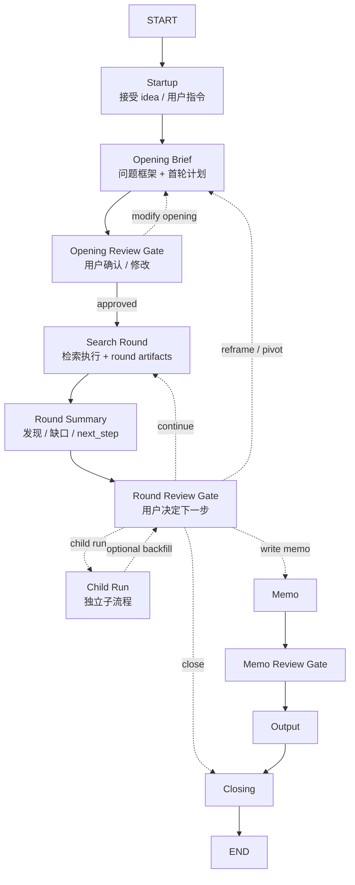
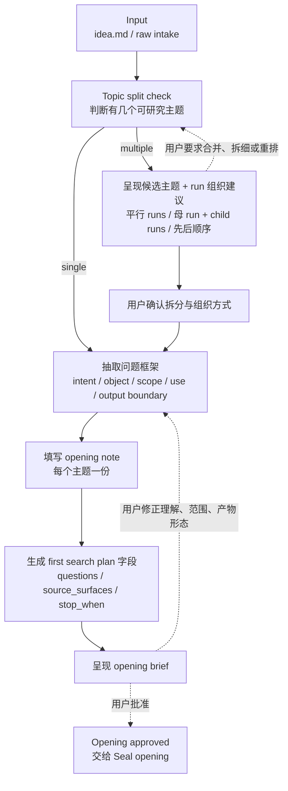
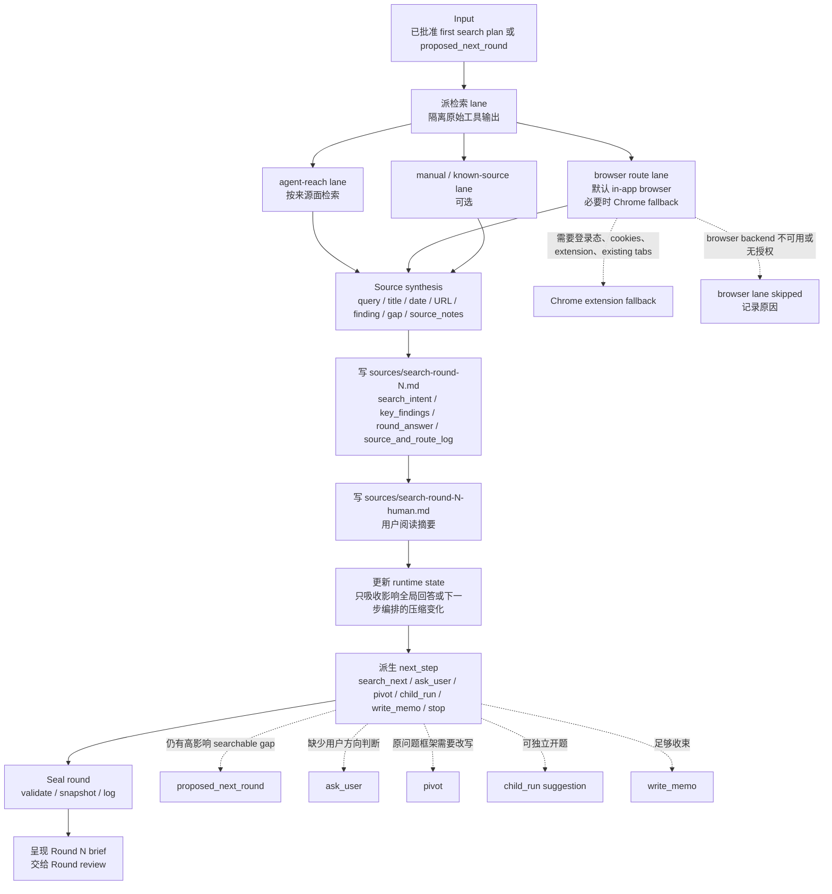
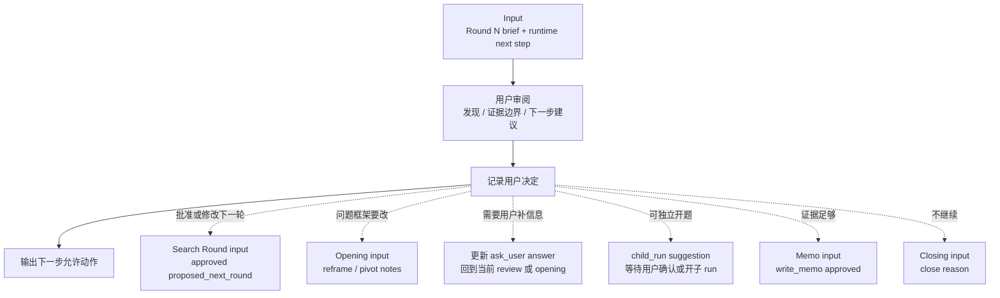
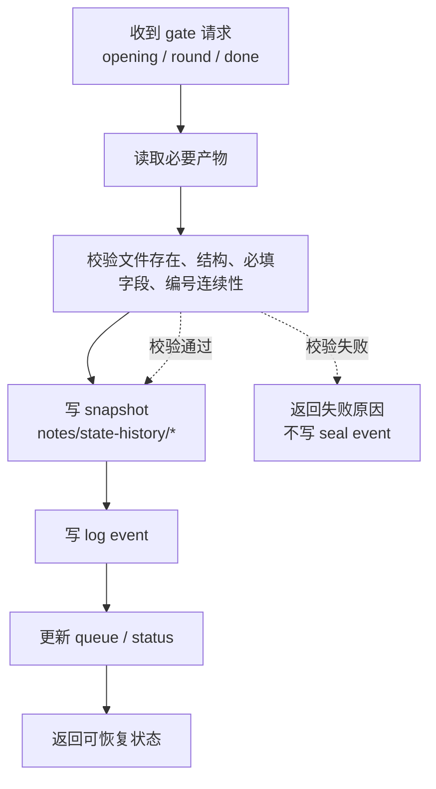
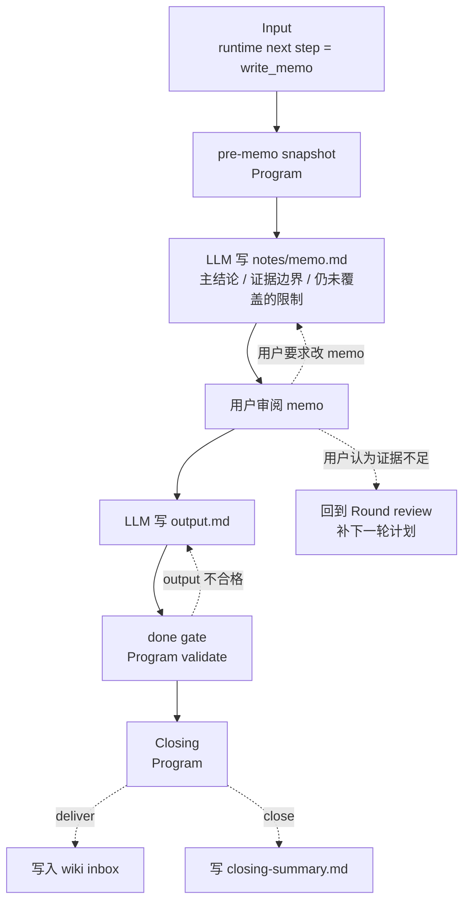
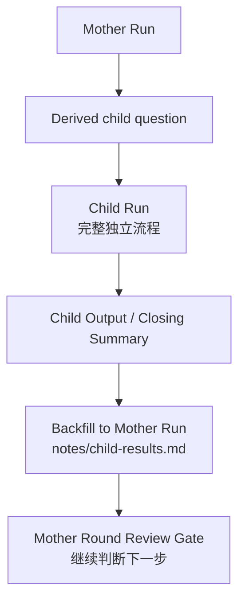

# 研究 runner 目标流程总览

状态：节点化草案

## 0. 定位

这份文档只描述一次 research run 的系统级流程。新的目标不是自动跑完整个研究，而是把研究拆成可审阅、可封账、可恢复的 workflow nodes。

这里借鉴 LangGraph 的 workflow 思路：先把流程拆成 discrete nodes；每个 node 做一个明确功能；不同 node 通过共享 state 交接；路线选择发生在 node 内部，而不是让脚本隐式自动推进。Dify 先只作为固定工作流 / 可视化编排产品形态的参照，不在本轮展开字段或实现。本文只先固定流程图，不展开字段模板。

图的讨论基准放在本文。`../90-knowledge/how-to-draw-langgraph-workflow.md` 只保留调研依据和画图原则；项目自己的总图、子图和节点契约表以后都在本文维护。

参考来源：

- LangGraph, `Thinking in LangGraph`, Step 1: Map out your workflow as discrete steps, <https://docs.langchain.com/oss/python/langgraph/thinking-in-langgraph>，核对日期：2026-06-17。

## 1. 画图约定

| 图形/连线 | 含义 | 约束 |
|---|---|---|
| 大 node | 一个可单独解释、审阅或封账的工作单元 | node 内部可以有小节点，但对外只暴露输入、输出和下一步建议 |
| 实线 `-->` | 默认顺序交接 | 上一个 node 完成后，无需路线判断即可进入下一个 node |
| 虚线 `-.->` | conditional route | 路线判断发生在上一 node 内部；虚线可以连到另一个 node，但不表示脚本自动推进 |
| 用户审阅 node | human input / interrupt 点 | 用户批准或修改后，后续 node 才能开始 |
| Program / Controller node | 脚本、CLI、validator、snapshot、log | 只做结构性动作，不替 LLM 推导语义，不替用户批准 |
| LLM node | 解释、压缩、生成、修订语义产物 | 写语义文件，但不直接写 queue/log/seal 事件 |
| Search lane node | 隔离检索执行 | 原始搜索/浏览器输出不进入母上下文，只返回结构化压缩结果 |

## 2. 系统级节点

| Node | 类型 | 目标 | 主要输入 | 主要输出 |
|---|---|---|---|---|
| Startup | Program | 接受 idea 或用户指令，创建 run 入口 | idea 列表选择、指定 idea 文件、用户口述主题 | `idea.md`、初始 log / queue |
| Opening Brief | LLM | 把 raw intake 变成可审阅的问题框架和首轮检索计划 | `idea.md`、用户补充 | opening note、opening brief |
| Opening Review Gate | User review | 确认理解是否正确、首轮计划是否可执行 | opening brief | opening decision / revised opening input |
| Search Round | LLM + Search lanes + Program | 执行一轮检索、压缩证据、更新当前态、提出下一步 | 已批准的 first search plan 或 `proposed_next_round` | `sources/search-round-N.md`、`sources/search-round-N-human.md`、runtime state update、round seal |
| Round Summary | Artifact | 把本轮发现、缺口和下一步建议交给用户审阅 | search round artifacts | round brief / runtime next step |
| Round Review Gate | User review | 审阅本轮发现和下一步建议 | round brief / runtime next step | 用户决定：继续 / 修改 / pivot / child run / memo / stop |
| Child Run | Independent run | 独立处理派生子课题，再按需回填母 run | derived child question | child output / closing summary / optional backfill |
| Memo | LLM | 把多轮判断收束成最终写作依据 | 当前 runtime state、已批准的 enoughness | `notes/memo.md` |
| Memo Review Gate | User review | 确认最终写作依据是否足够、表达边界是否正确 | `notes/memo.md` | memo decision |
| Output | LLM | 写内容最终化草稿 | `notes/memo.md`、sources | `output.md` |
| Closing | Program | done gate 后投递或关闭 | `output.md` 或关闭理由 | wiki inbox 文件或 `notes/closing-summary.md` |

## 3. 目标流程总图

总图只放会改变控制流、状态边界、人工审批或产物交接的大 node。Program seal、fallback、字段修复、source lane 合并等细节不放总图，全部下沉到后面的内部图。

这张总图只回答“有哪些大 node、主要怎么连”。`Round Review Gate` 的虚线表示路线判断发生在 review node 内部：继续搜索、重定向 opening、开 child run、进入 memo 或关闭。`Search Round` 内部的检索 lane、证据压缩、state 更新和 seal 不在总图展开。

Startup 的现实输入通常有三种：

- 从 idea 列表中选择一个待研究条目。
- 直接指定某个 idea 文件，常见于从 triage 过来后立刻开 run。
- 用户在对话中口述一段研究主题或问题。

Startup 可以在内部完成 raw intake 保存、run id 创建、初始状态参数传递等机械动作；这些不进入总图，只体现在节点契约和后续实现里。

## 4. Opening node 内部图

Opening 的职责是把 raw intake 转成用户可审阅的初始状态和首轮计划。它不执行检索。

边界：

- 原始输入只作为 `origin_context.raw_input` 保留：来自 `idea.md` 就挂路径或链接，来自口述就记录原文；它不是 Opening 图里的主流程节点。
- Topic split check 的输入是 raw intake；输出是候选主题数量、每个主题的简略方向、原始输入，以及初步 run 组织建议。
- 如果 raw intake 混有多个可独立研究的主题，先把 Split Summary 反馈给用户；用户确认后，再进入对应主题的 opening note 填写。
- Split Summary 不替代 opening note；它只判断是否拆分、候选主题是什么、建议如何组织。每个被选中的主题仍各自生成一份 opening note / opening brief。
- Opening 的必填项、一级 / 二级字段和缺失反馈规则，属于 `../10-opening/opening-note-template-v2-review.md` 的模板设计，不放进节点图。
- Opening 返修时，先根据用户反馈更新 opening note，再由 opening note 重新生成 opening brief。
- Opening brief 只作为审阅视图，不直接维护语义字段；若 brief 与 note 不一致，以 opening note 为准并重新生成 brief。
- 用户对 brief 的反馈应回写到 opening note 的对应字段或 derived 字段，而不是直接改 brief 展示字段。

## 5. Search round node 内部图

Search round 是本流程最复杂的大 node。它内部包含检索 lanes、证据压缩、state 写回、下一步建议和 seal，但对外只交付一份可审阅的 round brief。

边界：

- `sources/search-round-N.md` 记录本轮为什么搜、搜到了什么、证据能支撑什么、还有什么缺口。
- Runtime state 不复制本轮来源清单，只保存会影响全局回答草稿或下一步动作的压缩结果。
- `proposed_next_round` 是审阅对象，不是自动执行指令。
- browser route lane 默认只读；fallback / skipped 必须写进 `source_notes`。

## 6. Round Review node 内部图

Round Review 是用户控制点。它不执行搜索，也不直接写最终稿；它只把本轮 round brief 转成下一步允许发生的动作。

边界：

- `Round Review` 只处理用户决策，不补写搜索证据。
- 用户修改 `proposed_next_round` 后，修改后的版本才成为下一轮 `Search Round` 输入。
- `child_run suggestion` 不是自动开 run；是否开子 run 仍由用户或后续明确动作决定。

## 7. Program / Controller node 内部图

Program / Controller node 只做可验证的结构性动作。它不理解研究内容，不替 LLM 生成语义字段。

边界：

- Program 可以写 log、queue、snapshot、status。
- Program 不调用 LLM，不启动 search lane，不批准 opening 或下一轮。
- 任何 seal 失败都应停在当前 gate，等待 LLM 修复语义产物或用户修改决定。

## 8. Memo / Output / Closing 内部图

Memo 负责把多轮研究压成用户可确认的写作依据；Output 负责最终文稿；Closing 负责投递或关闭。

边界：

- `output.md` 是 content-finalized，不做 wiki placement，不写 wikilinks。
- Closing 的 deliver 是唯一允许写入 wiki inbox 的 runner 输出通道。
- close 不等于失败；它记录为什么不投递，以及当前可复用结论在哪里。

## 9. Child Run / backfill 树图

子课题不要塞进单次主流程图，应单独画树。主流程只保留 `child run` 出口和可选回填口。

边界：

- `Child Run` 有独立 opening、search round、review、memo/output/closing。
- 母 run 不复制子 run 的全部证据，只回填关键结论、产出位置和回填时间。
- 是否回填仍由用户决定，不由 child run 自动写母 run。

## 10. 节点契约表

每张流程图后续都应能补一张节点契约表。本文先固定字段和系统级样例，后续实现 LangGraph 时可以按同一表格检查 node 边界。

| 字段 | 说明 |
|---|---|
| Node | 节点名 |
| 类型 | Program / LLM / Search lane / Human review / Artifact |
| 触发者 | 用户、LLM、脚本、外部事件 |
| 读取 | 读取哪些 artifact / state |
| 写入 | 写哪些 artifact / state |
| 控制出口 | 下一步可能去哪 |
| 失败/阻塞 | 失败时如何停住或恢复 |
| 是否进总图 | 是 / 否；理由 |

| Node | 类型 | 读取 | 写入 | 控制出口 | 是否进总图 |
|---|---|---|---|---|---|
| Opening Brief | LLM | `idea.md` | opening note、opening brief | Opening Review Gate | 是；生成第一个可审阅产物 |
| Opening Review Gate | Human review | opening brief | 用户决定、必要修订 | Search Round / Opening Brief | 是；人工审批控制点 |
| Search Round | LLM + Search lanes + Program | approved search plan | `sources/search-round-N.md`、human summary、state update | Round Summary | 是；重执行节点 |
| agent-reach lane | Search lane | search plan | compressed lane result | Source synthesis | 否；放 Search Round 子图 |
| browser route lane | Search lane | search plan | compressed lane result / fallback reason | Source synthesis | 否；放 Search Round 子图 |
| Round Review Gate | Human review | Round Summary | 用户决策、next action | Search / Reframe / Child / Memo / Close | 是；路线分叉点 |
| Child Run | Independent run | derived child question | child output / closing summary | Optional backfill / Mother review | 是；它改变母 run 的后续路线 |
| Memo Review Gate | Human review | `notes/memo.md` | 用户决定、必要修订 | Output / Round Review | 是；最终写作前的证据边界确认 |

## 11. 用户审阅点

系统默认有三个审阅点：

| 审阅点 | 用户判断什么 | 可能去向 |
|---|---|---|
| Opening review | “我是不是被理解对了？”“第一轮准备怎么搜？” | 修改 opening / seal opening |
| Round review | “本轮发现是否可信？”“还要不要搜？”“下一轮问题是否对？” | 下一轮 search / 修改计划 / pivot / child run / memo / stop |
| Memo review | “当前证据能不能写进最终稿？”“表达边界是否正确？” | 改 memo / 回到 round review / 写 output |

因此不再单独设计“系统是否触发澄清”的主流程。澄清就是用户对 review brief 的批改；可搜索缺口进入 `search_next`，用户专属方向判断进入 `ask_user`。
