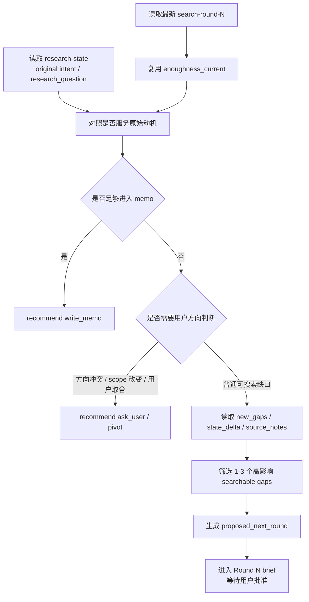

# Search question 派生设计

状态：简化草案
上级流程：`stage-search.md`

## 0. 定位

本文只回答一个问题：每轮 search round 结束后，如何从本轮结果派生 `proposed_next_round`，供用户审阅。

`proposed_next_round` 不是自动执行指令。它必须进入 Round N brief，等待用户批准或修改。

## 1. 核心判断

下一轮问题只从三个锚点派生：

1. `original intent`：用户最初为什么问，以及当前 research question 是什么。
2. `enoughness_current`：本轮证据足够支持什么、不足以支持什么。
3. `gaps`：本轮暴露的缺口，包括 `new_gaps`、`state_delta`、`source_notes`。

判断顺序：

```text
original intent
  + enoughness_current
  -> 判断本轮是否已经足够进入 memo
  -> 判断本轮 enoughness 是否仍服务 original intent
  -> 判断是否需要用户先做方向选择
  -> 从 gaps 中筛选 1-3 个高影响 searchable gaps
  -> 生成 proposed_next_round
  -> 放入 Round N brief 等待用户审阅
```

## 2. 派生流程图



## 3. `proposed_next_round` 最小字段

```yaml
proposed_next_round:
  questions:
    - question:
      helps_original_intent:
      derived_from:
      expected_source_surfaces:
      stop_when:
  recommendation: search_next | ask_user | pivot | write_memo | child_run | stop
  user_decision_needed:
```

字段说明：

- `question`：自然语言问题，不是裸 query。
- `helps_original_intent`：说明为什么这个问题仍服务原始动机。
- `derived_from`：指出来自 `enoughness_current`、`new_gaps`、`state_delta` 或 `source_notes`。
- `expected_source_surfaces`：说明要看官方、一手、学术、新闻、社区、案例等哪类来源面。
- `stop_when`：说明什么证据足够停止这一轮。

## 4. 什么可以进入下一轮

只有高影响 searchable gap 才进入 `proposed_next_round`：

- 它阻止回答 original intent。
- 它阻止本轮 search intent 被完整回答。
- 它会改变结论方向。
- 它影响证据等级或来源可信度。
- 它影响建议是否可执行。

普通“还能多了解一点”的缺口不进入下一轮，只记录为 deferred gap 或 weak claim。

## 5. 什么时候不生成搜索计划

以下情况不应继续生成下一轮搜索问题，而应在 Round N brief 中建议用户决策：

- 本轮证据推翻了原始 motivation。
- 下一步会明显扩大 scope。
- 下一步会改变 action boundary。
- 下一步其实是用户偏好或风险取舍。
- 当前证据已经足够进入 memo。

## 6. 与 search round 模板的关系

派生阶段不新增 `provisional_answer` 文件，也不重写本轮判断。它直接读取：

- `search_intent`
- `key_findings`
- `source_notes`
- `search_round_summary.state_delta`
- `search_round_summary.new_gaps`
- `search_round_summary.enoughness_current`
- `search_round_summary.next_search_options`
- `search_round_summary.agent_recommendation`

然后把必要信息压成 `proposed_next_round`，放进 Round N brief 给用户审阅。
