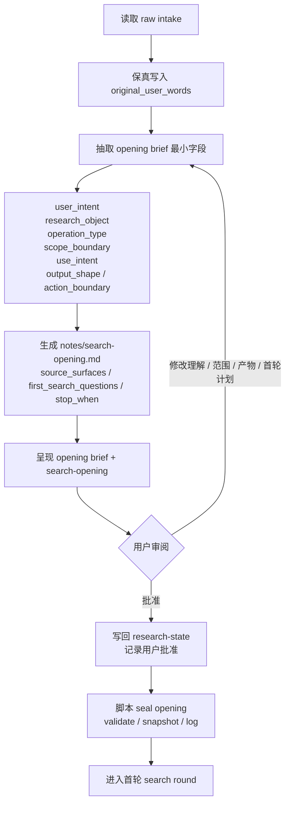

# 阶段细节：Opening 与 search-opening

状态：简化草案
上级流程：`workflow-cli-target-flow.md`

## 0. 阶段目标

Opening 阶段负责把 raw intake 变成用户可审阅的 opening brief，并生成首轮检索计划 `notes/search-opening.md`。

本阶段不执行检索，不判断最终证据是否足够，也不自动进入 search round。只有用户批准 opening brief 后，脚本才执行 `seal opening`。

## 1. 阶段流程



## 2. Opening brief 最小字段

Opening brief 是用户审阅视图，可由 `research-state` 和 `notes/search-opening.md` 渲染得到。它至少展示：

- `user_intent`
- `research_object`
- `operation_type`
- `scope_boundary`
- `use_intent`
- `output_shape / action_boundary`
- `source_surfaces`
- `first_search_questions`
- `stop_when`
- `temporary_or_default_fields`

这些字段的目标是让用户快速批改“我是不是被理解对了”和“第一轮准备怎么搜”。

## 3. `notes/search-opening.md`

`notes/search-opening.md` 是 opening 批准后的首轮检索计划。

它不是：

- 已执行检索记录
- sources 目录下的证据文件

建议最小内容：

```markdown
# Search opening

## opening brief

- user_intent:
- research_object:
- operation_type:
- scope_boundary:
- use_intent:
- output_shape / action_boundary:
- temporary_or_default_fields:

## first search plan

- source_surfaces:
- first_search_questions:
- stop_when:

## user review

- decision: confirmed | revised
- user_feedback:
- reviewed_at:
```

## 4. 写入边界

LLM 可以写：

- `notes/research-state.md`
- `notes/search-opening.md`

脚本可以写：

- `notes/state-history/research-state-opening.md`
- seal opening log event
- queue / status 中的结构性状态

LLM 不直接写 queue、log 或 seal 事件。脚本不替 LLM 推导语义字段，也不替用户批准 opening。

## 5. 不在本阶段处理

- 多轮检索执行。
- search round 证据合并。
- search 后 enoughness 判断。
- memo / output 写作。
