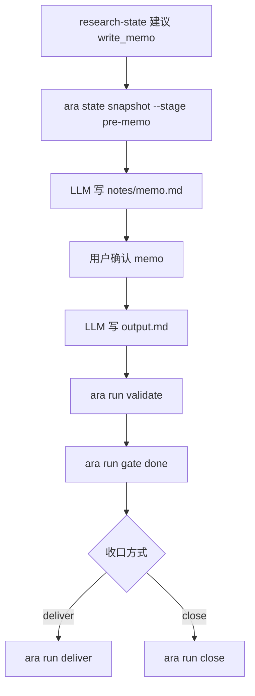

# 阶段细节：Memo、Output 与收口

状态：草案
创建时间：2026-06-12
上级流程：`workflow-cli-target-flow.md`

## 0. 阶段目标

本阶段负责把检索阶段的判断收束成用户可确认的 memo，再写成最终 `output.md`，最后投递或关闭 run。

## 1. 阶段流程



## 2. Memo review

Memo review 的作用是让用户确认：

- 当前证据是否足够。
- action boundary 是否正确。
- 哪些建议或判断允许进入最终 output。

Memo review 不是 queue gate，但需要留下可审计产物。

## 3. Output 要求

`output.md` 应满足：

- 内容最终化。
- 有 inline source citations。
- 不写 wikilinks。
- 不决定 wiki/blog placement。
- 不写 Related section。
- frontmatter 符合 `sop/template-output.md`。

## 4. Done gate

`ara run gate <run-id> done` 校验：

- `output.md` 存在且非空。
- frontmatter 必填字段存在。
- memo review 已完成或有明确跳过理由。

## 5. 收口方式

投递：

```powershell
ara run deliver <run-id>
```

关闭：

```powershell
ara run close <run-id> --summary "<summary>" --reason "<reason>"
```

投递写 wiki inbox；关闭写 `notes/closing-summary.md`。
