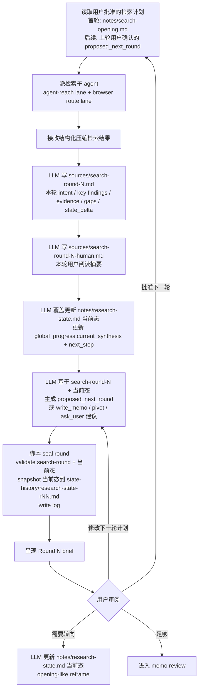

# 阶段细节：Search round 与用户审阅

状态：简化草案
上级流程：`workflow-cli-target-flow.md`

## 0. 阶段目标

Search round 阶段负责按用户批准的计划执行一轮检索，写入审计记录和人类阅读摘要，覆盖更新当前 `notes/research-state.md`，并生成 `proposed_next_round` 供用户审阅。

本阶段不自动进入下一轮。下一轮只能由用户批准或修改后开始。

## 1. 阶段流程

## 2. Round N brief 最小字段

Round brief 是用户审阅视图，可由 `sources/search-round-N.md`、`sources/search-round-N-human.md` 和 `research-state` 渲染得到。它至少展示：

- `original_intent`
- `previous_search_intent`
- `what_this_round_found`
- `enough_for`
- `not_enough_for`
- `state_changed`
- `remaining_gaps`
- `proposed_next_round`
- `recommendation`
- `user_decision_needed`

与 opening brief 的区别：

- opening brief 没有 `previous_search_intent`。
- opening brief 不判断上一轮 search intent 是否满足。
- search round brief 必须说明本轮 enoughness 是否仍服务 original intent。

## 3. 检索轮次产物

LLM 写：

- `sources/search-round-N.md`
- `sources/search-round-N-human.md`
- 覆盖更新 `notes/research-state.md` 当前态

脚本写：

- `notes/state-history/research-state-rNN.md`
- seal round log event
- status / queue 中的结构性状态

## 4. 强制检索边界

每轮检索仍遵守现有隔离要求：

- 检索动作通过检索子 agent 执行。
- 每轮至少包含 `agent-reach lane` 和 `browser route lane`。
- 母 agent 只接收结构化压缩结果。
- 原始工具输出不进入 run 文档。

## 5. 下一轮计划

`proposed_next_round` 是审阅对象，不是自动执行指令。它至少说明：

- 下一轮要回答的 1-3 个问题。
- 每个问题如何服务 original intent。
- 预期来源面。
- 何时停止。
- 是否需要用户先做方向判断。

用户批准后，它才成为下一轮 search round 的输入。
