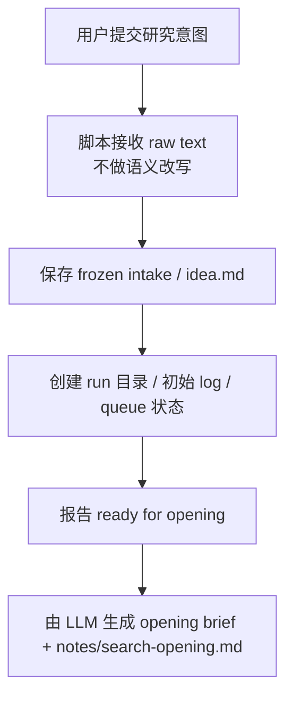

# 阶段细节：Startup

状态：简化草案
上级流程：`workflow-cli-target-flow.md`

## 0. 阶段目标

Startup 只负责把用户输入保存成 run，不做语义理解，不生成 opening 判断，不启动自动推进器。

## 1. 阶段流程

## 2. 边界

Startup 可以写：

- `runs/<run-id>/idea.md`
- 初始 log event
- queue / status 的结构性记录

Startup 不写：

- `research-state`
- `notes/search-opening.md`
- search round 产物
- memo / output

Startup 不调用 LLM，也不决定下一步搜索计划。
