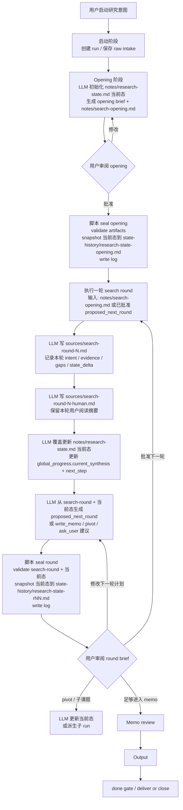

# 研究 runner 目标流程总览

状态：简化草案

## 0. 定位

这份文档只描述一次 research run 的系统级流程。新的目标不是自动跑完整个研究，而是把研究拆成可审阅的轮次：

- startup 保存原始输入。
- opening 生成用户可审阅的意图 brief 和首轮检索计划。
- 每轮 search round 结束后生成 round brief 和 `proposed_next_round`。
- 用户决定继续、修改、pivot、拆子 run 或进入 memo。
- 脚本只做封账：校验、快照、日志、状态查询。

## 1. 系统级阶段

| 阶段 | 目标 | 主要产物 |
|---|---|---|
| Startup | 创建 run，保存 raw intake | `idea.md`、log / queue 初始记录 |
| Opening | 生成 opening brief、初始化当前态和首轮计划 | `notes/research-state.md`、`notes/search-opening.md` |
| Seal opening | 封存 opening 当前态 | `notes/state-history/research-state-opening.md`、log event |
| Search round | 执行一轮检索并更新判断 | `sources/search-round-N.md`、`sources/search-round-N-human.md`、覆盖更新 `notes/research-state.md` |
| Seal round | 封存本轮当前态 | `notes/state-history/research-state-rNN.md`、log event |
| User review | 用户审阅 round brief | 用户决定：继续 / 修改 / pivot / child run / memo |
| Memo / Output | 收束判断并写最终稿 | `notes/memo.md`、`output.md` |
| Closing | done gate 后投递或关闭 | wiki inbox 文件或 closing summary |

## 2. 目标流程总图

## 3. 脚本边界

脚本负责：

- 创建 run、保存 raw intake、记录 log。
- 校验 opening / round / done 的必要产物。
- seal 时把当前 `notes/research-state.md` 快照到 `notes/state-history/`。
- 写入 seal 事件和状态查询结果。

脚本不负责：

- 自动调用 LLM。
- 自动执行下一轮 search。
- 判断研究结论是否足够。
- 替用户批准 `notes/search-opening.md` 或 `proposed_next_round`。

## 4. 用户审阅点

系统默认有两个审阅点：

1. Opening 审阅：确认 `user_intent`、scope、action boundary 和首轮检索计划。
2. Round 审阅：确认本轮发现、enoughness、剩余 gap 和下一轮计划。

因此不再单独设计“系统是否触发澄清”的主流程。澄清就是用户对 brief 的批改。
